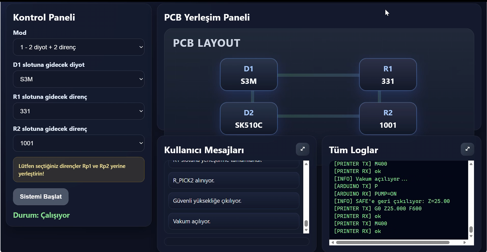
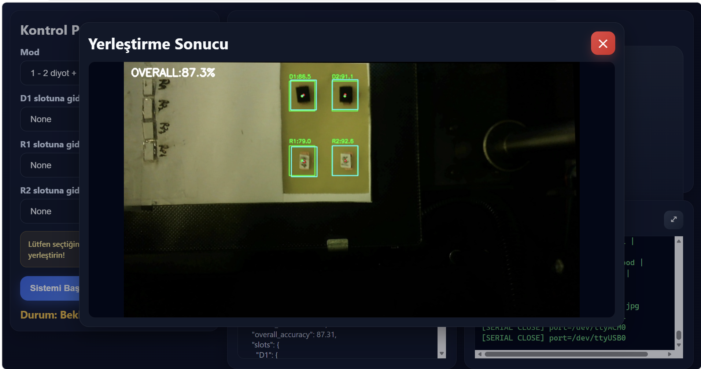
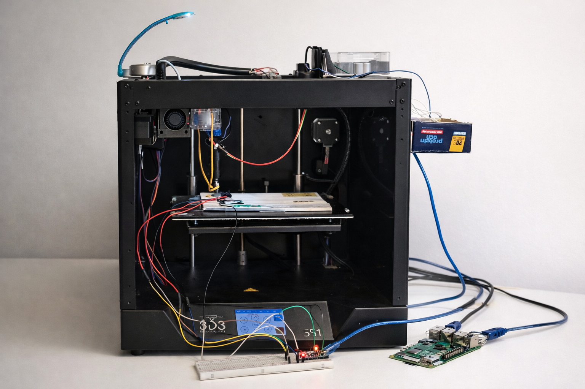

# TOBB ETU ELE495 - Capstone Project
# ResistAndPlace

## Table of Contents
- [Introduction](#introduction)
- [Features](#features)
  - [Hardware](#hardware)
  - [Operating System and Packages](#operating-system-and-packages)
  - [Applications](#applications)
  - [Services](#services)
- [Installation](#installation)
- [Usage](#usage)
- [Screenshots](#screenshots)
- [Project Structure](#project-structure)
- [Acknowledgements](#acknowledgements)
- [Team](#team)
- [Course](#course)

## Introduction

ResistAndPlace is an autonomous desktop pick-and-place and testing system developed for the ELE495 Capstone Project at TOBB ETU.

The main goal of this project is to automatically pick SMD components, test them, and place them onto the correct PCB locations. The system combines a 3D-printer-based motion platform, a vacuum pickup mechanism, embedded controllers, a camera-based verification system, and a web-based user interface.

The project is designed to reduce manual placement errors and demonstrate the integration of embedded systems, machine vision, motion control, and automated testing in a single platform.

## Features

- Automatic pick-and-place of SMD components
- Vacuum-based component pickup mechanism
- Resistor value detection
- Diode polarity and type checking
- Smart PCB slot-based placement
- Placement verification using image processing
- Web-based control panel
- Real-time system logs and user messages
- End-of-process placement accuracy reporting

### Hardware

- 3D printer mechanism used as XY-Z motion platform
- Raspberry Pi
- Arduino Uno
- Arduino Nano
- USB camera
- Vacuum pump
- Test PCB
- Component test circuits for resistor and diode checking
- Breadboard and interface electronics

### Operating System and Packages

- Raspberry Pi OS
- Python 3
- OpenCV
- Flask
- PySerial
- NumPy

### Applications

- Main automation software
- Web-based user interface
- Camera capture and image processing modules
- Component testing and classification modules
- Placement verification software

### Services

- Local Flask server for the web interface
- Serial communication between Raspberry Pi and microcontrollers
- Camera-based image acquisition and verification pipeline

## Installation

Project source files, reports, poster, and media are available in this repository for documentation and demonstration purposes.

## Usage

The system is operated through the web interface.

1. Power on the system.
2. Connect all required hardware modules.
3. Start the main control software on the Raspberry Pi.
4. Open the web interface.
5. Select the operating mode and PCB component configuration.
6. Start the automated placement cycle.
7. Monitor the logs, user messages, and placement verification results.

### Example Workflow

1. The system picks a component from the pickup area.
2. It moves the component to the test station.
3. The component is identified as a resistor or diode.
4. Its value or polarity is checked.
5. If the result matches the requested slot, the component is placed onto the PCB.
6. At the end of the process, the vision system verifies placement accuracy and reports the overall result.

## Screenshots

### Web Interface



### Placement Verification Result



### Final System



### Demo Video

YouTube playlist: [](https://youtube.com/)

## Project Structure

```text
README.md

code/
  main_system/
  web_ui/
  vacuum_control/
  test_station/
  camera_capture/
  vision_detection/

media/
  web_interface.png
  placement_result.png
  system_overview.png

docs/
  Final_Report.pdf
  Report1.pdf
  Report2.pdf
  Final_Poster.pdf
```

## Acknowledgements

We would like to thank our instructors and advisors for their guidance throughout this project.

This project was developed as part of the TOBB ETU ELE495 Capstone Project course.

## Team

- Erkin Coşkun Ruhi
- Enes Talha Yegin
- Gaye Erdoğan
- Arda Cevdet Aslangül

## Course

ELE495 - Capstone Project  
TOBB University of Economics and Technology
